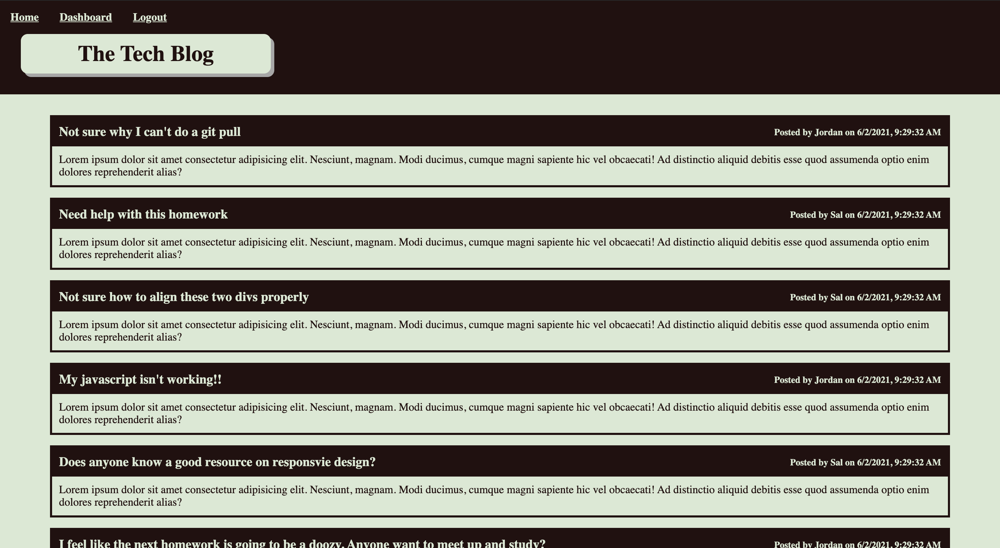

# Tech Blog

  
## Description

A blog where users can post questions about web development, see others' questions, and comment on their posts. 

## Table of Contents

- [Installation](#installation)
- [Usage](#usage)
- [License](#license)
- [Contributing](#contributing)
- [Tests](#tests)
- [Questions](#questions)

## Installation

To install necessary dependencies, run the following command:

> npm i 

## Tests

To run tests, run the following command:

> npm test 

## Usage

Users can view all posts on the homepage, including when it was posted and by whom. By clicking on a post, a user can view the post on its own page as well as any associated comments. Once a user logs in or signs up, they can make comments on others' posts. In addition, they have access to their dashboard, where they can view all of their own posts, create new posts, or edit and/or delete old posts.

## License

This application is covered under the following license: None

## Contributing

All contributions are welcome!

## Link

https://ryanascherr.github.io/tech-blog/

## Questions

Have questions? Contact this project's creator at ryanascherr@gmail.com.

Their GitHub profile page is https://github.com/ryanascherr.
